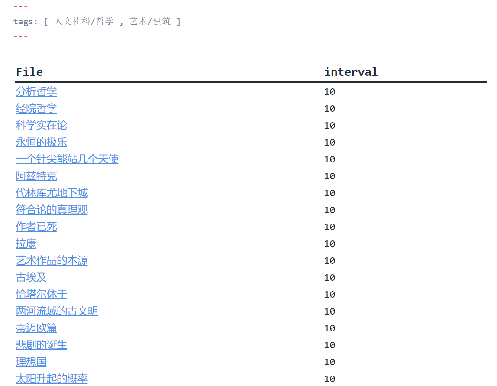
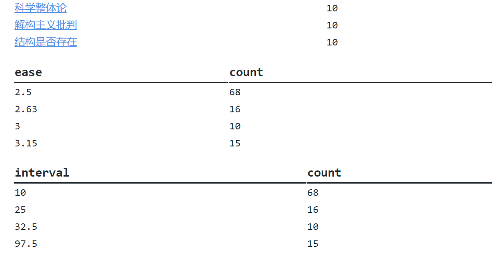

# Obsidian Review Plugin

基于简化了的 `Anki` 算法，安排你的复习笔记的计划

## 安装与使用

### 启用该插件

- 复制 `manifest.json`, `main.js` 到`your-vault/.obsidian/plugins/obsidian-review`下

- 打开 `obsidian` ，启用 `review` 插件

- 效果如下：

  

### 编写template文件

- 安装 `templater-obsidian` 插件

- 编写 `template` 文件，包含以下语句：
  ```
  ---
  ctime: <% tp.file.creation_date('YYYY-MM-DD') %>
  review: [2.5, 10.00]
  ---
  ```
  
- 其中 `review[0]` 表示初始熟悉度， `review[1]` 表示初始复习间隔

- 应用该 `template` 于你想要复习的文件，否则无法正常使用 `review` 插件

### 编写“待复习笔记一览”文件

该文件会展示出你待复习的笔记列表，以及复习情况的统计

- 为文件的 `front-matter` 添加 `tags` 属性，该属性用于选择欲复习笔记的 `tag` ，即，不在其中的笔记不会被复习
  ```
  ---
  tags: [ CS , 艺术 ]
  ---
  ```

  如果不想过滤，就写成`tags: [ ]`

- 安装 `dataviewjs` 插件，编写 `dataviewjs` 代码
  ```
  // 从文件头读取要筛选的标签
  let tags = dv.current().tags;
  tags = tags.map(b => '#' + b);
  
  // 查询条件
  let condition = '"" and -"template" and -"计划" and -#noreview';
  
  // 将那些标签添加到查询条件中
  if (tags.length != 0) {
    condition += ' and (';
    condition += tags.join(' or ');
    condition += ')';
  }
  
  // 待复习笔记的列表
  dv.table(["File", "interval"], dv.pages(condition)
    .where(b => b.review)
    .sort(b => b.ctime)
    .sort(b => b.review[1])
    .limit(21)
    .map(b => [b.file.link, b.review[1]])
  );
  
  // 换行
  dv.paragraph('\n');
  
  // 统计复习熟悉度的列表
  dv.table(["ease", "count"], dv.pages(condition)
    .where(b => b.review)
    .groupBy(b => b.review[0])
    .sort(b => b.key)
    .map(b => [b.key, b.rows.length])
  );
  
  // 换行
  dv.paragraph('\n');
  
  // 统计复习间隔的列表
  dv.table(["interval", "count"], dv.pages(condition)
    .where(b => b.review)
    .groupBy(b => b.review[1])
    .sort(b => b.key)
    .map(b => [b.key, b.rows.length])
  );
  ```
  
- 效果：
  
  

## 算法

在 `anki` 的基础上进行简化：

-  `easy` ： `(ease, interval) => [ease * 1.2, interval * ease * 1.3]` 
-  `good` ： `(ease, interval) => [ease * 1.05, interval * ease]` 
-  `hard` ： `(ease, interval) => [ease * 0.85 < 1.3 ? 1.3 : ease * 0.85, interval * 1.2]` 
-  `start over` ： `(ease, interval) => [ease * 0.8 < 1.3 ? 1.3 : ease * 0.8, 10]` 

