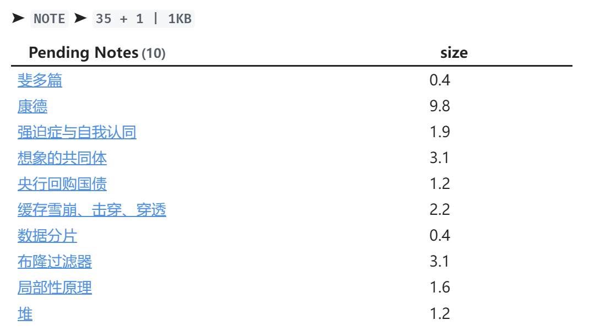

# Obsidian Review Plugin

基于简化了的 `Anki` 算法，安排你的复习笔记的计划

## 安装与使用

### 启用该插件

- `npm run build`

- 复制 `manifest.json`, `main.js` 到`your-vault/.obsidian/plugins/obsidian-review`下

- 打开 `obsidian` ，启用 `review` 插件

- 效果如下：

  

### 编写template文件

- 安装 `templater-obsidian` 插件

- 编写 `template` 文件，至少包含以下语句：
  ```
  ---
  tags: []
  review: [2.5, 1.0, <% tp.file.creation_date('YYYY-MM-DD') %>]
  ---
  ```
  
- 其中 `review[0]` 表示初始熟悉度， `review[1]` 表示初始复习间隔， `review[2]` 表示下次复习时间

- 应用该 `template` 于你想要复习的文件，**否则无法正常使用 `review` 插件**

### 编写review.md

该文件会展示出你待复习的笔记列表，以及复习情况的统计，注意该文件名称必须叫做review.md

安装 `dataviewjs` 插件，编写 `dataviewjs` 代码

```dataviewjs
// 基础过滤得到的笔记
let basicNotes = dv
  .pages('"" and -"assets"')
  .where(b => b.sr);

// 待复习的笔记
let toBeReviewedNotes = basicNotes
  .where(b => b.sr[2] <= dv.date('today'));

// 今日复习的笔记
let todayReviewedNotes = basicNotes
  .where(b => b.ctime - 0 != dv.date('today') || b.sr[2] - 0 != dv.date('tomorrow')) // 不是今天创建的笔记
  .where(b => b.sr[2] == dv.duration(`${Math.ceil(b.sr[1])}day`) + dv.date('today'));

// 待复习笔记的数目
let waitReviewCount = toBeReviewedNotes
  .values
  .reduce((sum, b) => sum + 1, 0);

// 今日复习的笔记的数目
let todayReviewedCount = todayReviewedNotes
  .values
  .reduce((sum, b) => sum + 1, 0);

// 今日复习的笔记的大小（KB）
let todayReviewedSize = (todayReviewedNotes
  .values
  .reduce((sum, b) => sum + b.file.size, 0) / 1024).toFixed(0);

let paragraph = dv.paragraph(`➤ **<code>NOTE</code>** ➤ **<code>${waitReviewCount} + ${todayReviewedCount} | ${todayReviewedSize}KB</code>**`);

let showSurprise = false;
paragraph.addEventListener("click", (evt) => {
    if (!showSurprise) {
        paragraph.innerHTML += " <b><code>Surprised ヽ(´▽`)/</code></b>";
        showSurprise = true;
    }
});

// 待复习笔记的列表
dv.table(["Pending Notes", "size"], toBeReviewedNotes
  .sort(b => b.sr[2])
  .limit(10)
  .map(b => [b.file.link, (b.file.size / 1024).toFixed(1)])
);
```

效果如下：



## 算法

在 `anki` 的基础上进行简化：

-  `easy` ： `(ease, interval) => [ease * 1.2, interval * newEase * 1.3]` 
-  `good` ： `(ease, interval) => [ease, interval * newEase]` 
-  `hard` ： `(ease, interval) => [ease * 0.85 < 1.3 ? 1.3 : ease * 0.85, interval * 0.5 < 1.0 ? 1.0 : interval * 0.5]` 
-  `delay` ：推迟7天复习
